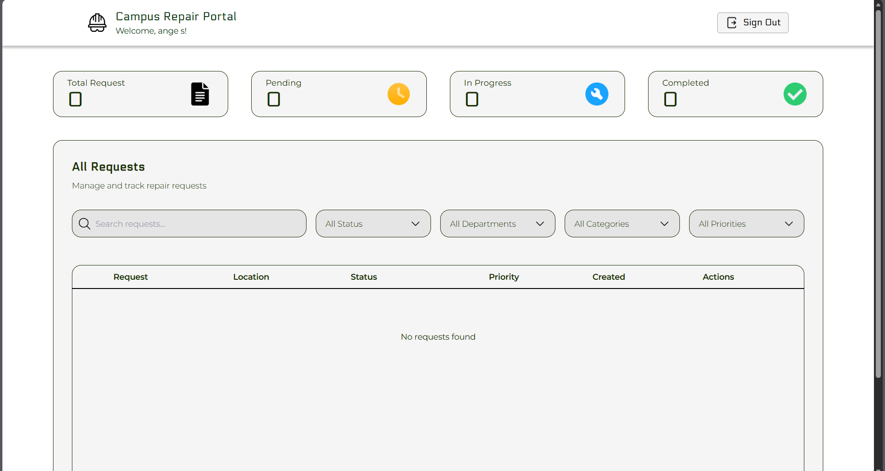
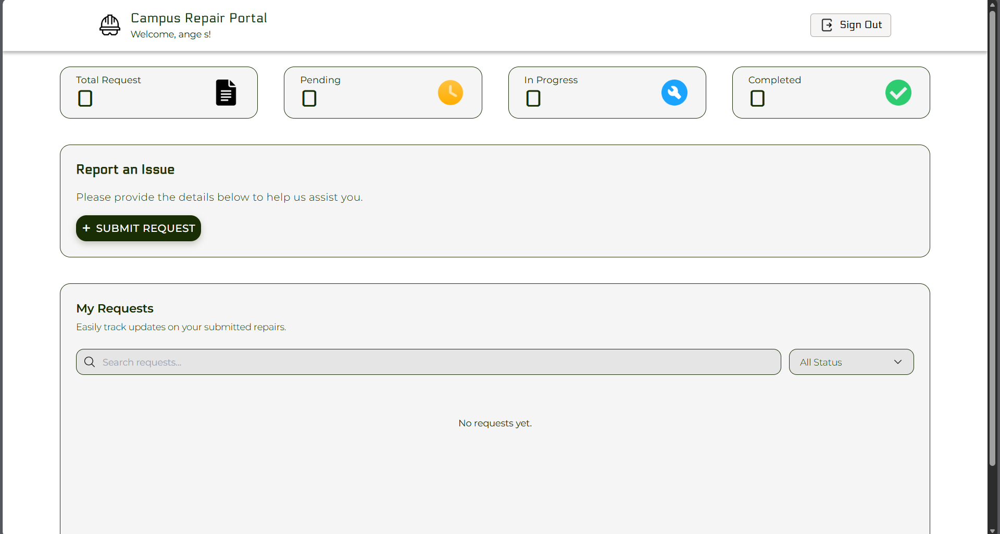
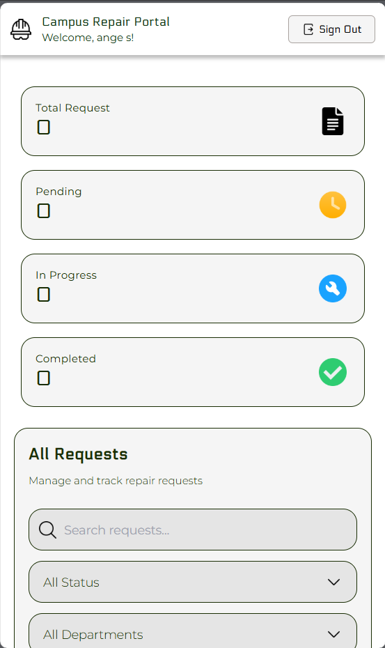

# Campus Repair Request and Tracking System

A web-based system for managing and tracking campus facility repair requests. Built with Next.js and Supabase, featuring role-based access control for requesters and maintenance personnel.

## Screenshots

### Personnel Dashboard

*Manage and track all repair requests with filtering and search capabilities*

### Requester Dashboard

*Submit and track your repair requests*

### Mobile View

*Fully responsive design optimized for mobile devices*

## Features

- **User Authentication**: Secure email/password authentication with email verification
- **Role-Based Access**: Separate dashboards for Requesters and Personnel
- **Mobile Responsive Design**: Optimized for all screen sizes from mobile to desktop
- **Repair Request Management**:
  - Submit repair requests with detailed information
  - Track request status (Pending, In Progress, Resolved, Cancelled)
  - View request history and details
  - Categorize requests (Electrical, Plumbing, Structural, etc.)
- **Personnel Dashboard**:
  - View all repair requests
  - Update request status
  - Add communication updates
  - Manage request assignments
- **Requester Dashboard**:
  - Submit new requests
  - Track submitted requests
  - View request status and updates

## Tech Stack

- **Framework**: [Next.js 14](https://nextjs.org/) (App Router)
- **Authentication & Database**: [Supabase](https://supabase.com/)
- **Styling**: [Tailwind CSS](https://tailwindcss.com/)
- **UI Components**: [Radix UI](https://www.radix-ui.com/)
- **Language**: [TypeScript](https://www.typescriptlang.org/)
- **Icons**: [Lucide React](https://lucide.dev/)

## Prerequisites

- Node.js 18+ and npm
- A Supabase account and project
- Git

## Getting Started

### 1. Clone the Repository

```bash
git clone <repository-url>
cd batch-2025-campus-repair-request-and-tracking-system-web
```

### 2. Install Dependencies

```bash
npm install
```

### 3. Set Up Environment Variables

Create a `.env.local` file in the root directory:

```env
NEXT_PUBLIC_SUPABASE_URL=your_supabase_project_url
NEXT_PUBLIC_SUPABASE_ANON_KEY=your_supabase_anon_key
```

You can find these values in your Supabase project settings under **API**.

### 4. Set Up Supabase Database

Create the following tables in your Supabase database:

#### `profile` table
```sql
CREATE TABLE profile (
  id UUID PRIMARY KEY DEFAULT uuid_generate_v4(),
  email_address TEXT UNIQUE NOT NULL,
  full_name TEXT,
  department TEXT,
  designation TEXT,
  contact_number TEXT,
  role TEXT NOT NULL, -- 'requester' or 'personnel'
  created_at TIMESTAMP WITH TIME ZONE DEFAULT NOW()
);
```

#### `categories` table
```sql
CREATE TABLE categories (
  id UUID PRIMARY KEY DEFAULT uuid_generate_v4(),
  name TEXT NOT NULL,
  description TEXT,
  created_at TIMESTAMP WITH TIME ZONE DEFAULT NOW()
);
```

#### `requests` table
```sql
CREATE TABLE requests (
  id UUID PRIMARY KEY DEFAULT uuid_generate_v4(),
  requester_id UUID REFERENCES profile(id),
  title TEXT NOT NULL,
  description TEXT,
  location TEXT,
  priority TEXT,
  status TEXT DEFAULT 'Pending',
  created_at TIMESTAMP WITH TIME ZONE DEFAULT NOW(),
  updated_at TIMESTAMP WITH TIME ZONE DEFAULT NOW()
);
```

#### `request_categories` table (junction table)
```sql
CREATE TABLE request_categories (
  request_id UUID REFERENCES requests(id) ON DELETE CASCADE,
  category_id UUID REFERENCES categories(id) ON DELETE CASCADE,
  PRIMARY KEY (request_id, category_id)
);
```

### 5. Configure Row Level Security (RLS)

Enable RLS on all tables and create policies:

```sql
-- Enable RLS
ALTER TABLE profile ENABLE ROW LEVEL SECURITY;
ALTER TABLE categories ENABLE ROW LEVEL SECURITY;
ALTER TABLE requests ENABLE ROW LEVEL SECURITY;
ALTER TABLE request_categories ENABLE ROW LEVEL SECURITY;

-- Example policies (adjust based on your needs)
CREATE POLICY "Users can view their own profile" ON profile
  FOR SELECT USING (auth.uid() = id);

CREATE POLICY "Anyone can view categories" ON categories
  FOR SELECT TO authenticated USING (true);

CREATE POLICY "Users can view all requests" ON requests
  FOR SELECT TO authenticated USING (true);

CREATE POLICY "Users can insert their own requests" ON requests
  FOR INSERT WITH CHECK (auth.uid() = requester_id);
```

### 6. Run the Development Server

```bash
npm run dev
```

Open [http://localhost:3000](http://localhost:3000) to view the application.

## Project Structure

```
├── app/
│   ├── (auth)/              # Authentication pages (login, signup)
│   ├── personnel/           # Personnel dashboard and pages
│   ├── requester/           # Requester dashboard and pages
│   ├── error/               # Error page
│   ├── globals.css          # Global styles
│   ├── layout.tsx           # Root layout
│   └── page.tsx             # Landing page
├── components/              # Reusable React components
│   ├── ui/                  # UI components (button, card, input, etc.)
│   └── ...                  # Feature components
├── lib/                     # Utility functions and actions
├── utils/
│   └── supabase/            # Supabase client configuration
├── data/                    # Static data and constants
└── public/                  # Static assets
```

## Available Scripts

- `npm run dev` - Start development server
- `npm run build` - Build for production
- `npm run start` - Start production server
- `npm run lint` - Run ESLint

## Deployment

### Deploy to Vercel

1. Push your code to GitHub
2. Import your repository in [Vercel](https://vercel.com)
3. Add environment variables in Vercel project settings:
   - `NEXT_PUBLIC_SUPABASE_URL`
   - `NEXT_PUBLIC_SUPABASE_ANON_KEY`
4. Deploy

The app will automatically build and deploy.

## User Roles

### Requester
- Submit repair requests
- View own requests
- Track request status

### Personnel
- View all repair requests
- Update request status
- Add communication updates
- Manage requests

## Contributing

1. Fork the repository
2. Create a feature branch (`git checkout -b feature/AmazingFeature`)
3. Commit your changes (`git commit -m 'Add some AmazingFeature'`)
4. Push to the branch (`git push origin feature/AmazingFeature`)
5. Open a Pull Request

## License

This project is part of an academic course requirement.

## Support

For issues and questions, please open an issue in the repository.